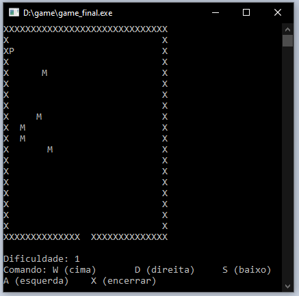

<!DOCTYPE html>
<html>
  <head>
    <h1><strong>G a m e</strong></h1>
  </head>
  <body>
    
<strong>CAVERNA DOS MONSTROS</strong>

    
    
FATEC &ndash; Americana

    
Tecnologia em Jogos Digitais

    
Trabalho 1&ordm; Semestre da disciplina de Programa&ccedil;&atilde;o I ministrado pelo professor Sofner.

    
O Jogo gera um cen&aacute;rio de uma caverna onde um personagem (P), deve buscar a sa&iacute;da ( &nbsp;) e n&atilde;o descuidar para que um monstro (M) n&atilde;o o devore. Esse game conta com um conjunto de movimentos do personagem (direita, esquerda, para cima, para baixo). Os movimentos dos monstros s&atilde;o aleat&oacute;rios e perseguem o personagem. Trata-se de um game simples mas divertido, foi desenvolvido em C com poucos recursos e bibliotecas.

  
  </body>
</html>
